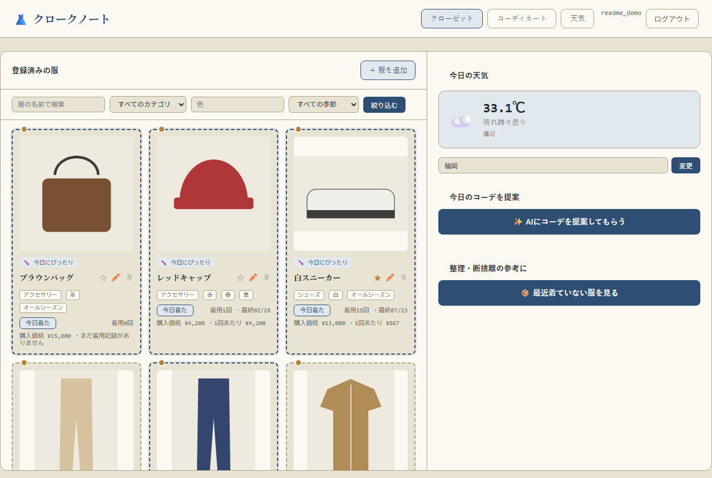
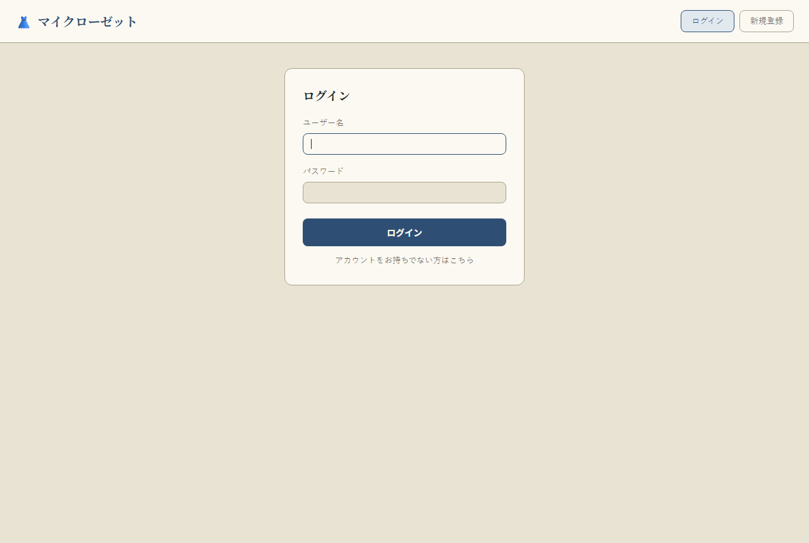
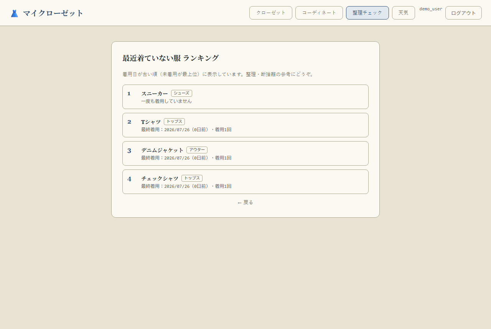

# クロークノート（Cloak Note）

服の管理・コーディネート提案ができる、家族・友人向けの小規模Webクローゼットアプリです。
Flask + SQLite で構築し、天気に応じたコーデ提案には Anthropic Claude API を使用しています。



## 主な機能

- **服の管理**：写真つきで登録・編集・削除、カテゴリ／色／季節でのタグ付け
- **検索・絞り込み**：名前・カテゴリ・色・季節でクローゼットを絞り込み
- **お気に入り・着用記録**：ワンタップでお気に入り登録、「今日着た」ボタンで着用回数を記録（1日1回まで、誤操作は取り消し可能）
- **購入価格・着用コスト表示**：登録した価格 ÷ 着用回数で1回あたりのコストを可視化
- **整理チェック（断捨離ランキング）**：着用日が古い服・未着用の服を一覧表示
- **コーディネート保存**：複数アイテムを組み合わせて保存し、色の相性もチェック
- **天気連動**：現在地（都市名は漢字入力にも対応）の天気を表示し、気温に合う季節の服を自動ハイライト
- **AIコーデ提案 / 画像からの自動タグ付け**：Claude APIで今日のコーデを提案、服の写真からカテゴリ・色・季節を自動判定（`ANTHROPIC_API_KEY`未設定時は該当機能を無効化して案内表示）
- **複数ユーザー対応**：ユーザーごとにクローゼットが分離されたログイン機能

| ログイン | 整理チェック |
|---|---|
|  |  |

## 使用技術

- **Backend**: Python / Flask / Flask-SQLAlchemy / Flask-Login / Flask-WTF（CSRF対策）
- **DB**: SQLite
- **AI**: Anthropic Claude API（画像認識・コーデ提案）
- **外部API**: 気象庁アメダス（天気取得）
- **Frontend**: Jinja2 テンプレート / Vanilla CSS・JavaScript（ビルドツールなし）

## セキュリティ面での工夫

- パスワードはハッシュ化して保存、CSRF対策済み
- ユーザーごとにデータを分離し、他人のIDを指定してもアクセス不可（所有者チェック）
- アップロード画像は拡張子検証＋ファイル名をUUID化して保存（パストラバーサル対策）
- `SECRET_KEY` などの秘密情報は環境変数（`.env`）で管理し、リポジトリには含めない

## ローカルでの動かし方

```bash
python -m venv venv
venv\Scripts\activate  # Windows
pip install -r requirements.txt
```

`.env` を作成し、以下を設定してください。

```
SECRET_KEY=（ランダムな文字列）
FLASK_DEBUG=True
ANTHROPIC_API_KEY=（任意。AI機能を使う場合のみ）
```

天気機能は気象庁アメダスの公開データを使用しており、APIキーは不要です。

```bash
python app.py
```

`http://127.0.0.1:5000` にアクセスし、「新規登録」から最初のアカウントを作成してください。

## デプロイ

家族・友人数人向けの小規模運用を想定した手順を [DEPLOY.md](DEPLOY.md) にまとめています。
